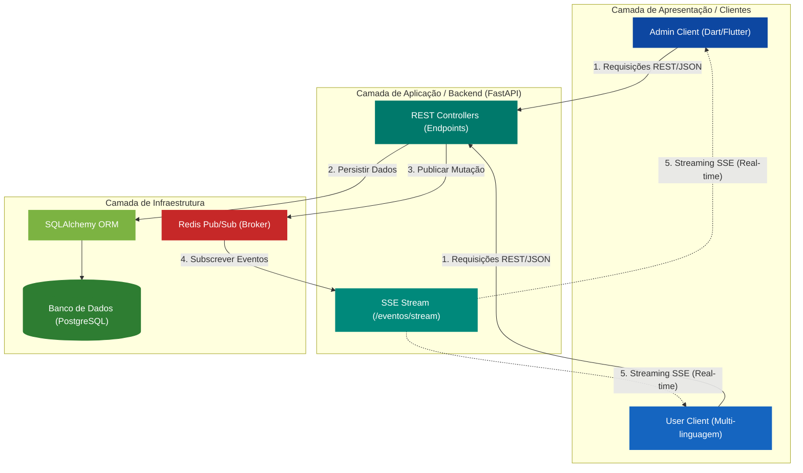

# Relatório Técnico: Desenvolvimento de Sistema Distribuído para Gerenciamento de Frotas Aéreas (Aircraft Manager)

Este documento apresenta o relatório técnico de especificação, projeto e análise do sistema **Aircraft Manager**, desenvolvido para as disciplinas de Sistemas Distribuídos. O sistema é composto por uma API REST (backend) em Python e um cliente administrativo (frontend) em Dart/Flutter.

*   **Disciplina**: Sistemas Distribuídos
*   **Componentes da Dupla**: Anaildo Nascimento, 552836 & Rewelli Oliveira, 554047
*   **Escopo do Documento**: Detalhar a implementação e conformidade com os requisitos do **Trabalho 3 (API REST)** e **Trabalho 4 (Comunicação Indireta / Publish-Subscribe)**.

---

## 1. Arquitetura Geral do Sistema

O sistema é construído sob uma arquitetura desacoplada, dividida em dois componentes principais que se comunicam através de rede local ou remota:

### 1.1. Diagrama de Arquitetura da Solução



### 1.2. Organização e Arquitetura do Cliente Administrativo (Flutter)

Este repositório (`aircrafts-admin`) contém o cliente em Flutter estruturado para seguir as melhores práticas de separação de responsabilidades (Clean Architecture e MVC simplificado). O código-fonte está organizado da seguinte forma no diretório `lib/`:

```text
lib/
├── models/             # Modelos de Dados (Entidades serializáveis em JSON)
│   ├── aeronave.dart
│   └── companhia.dart
├── services/           # Serviços de Rede e Integração (Comunicação)
│   ├── api_service.dart     # Conexão HTTP/REST (GET, POST, DELETE)
│   └── broker_service.dart  # Stream persistente de Server-Sent Events (SSE)
├── screens/            # Camada de Visualização (Telas e UI)
│   ├── home_screen.dart     # Dashboard / Lista de Companhias
│   ├── frota_screen.dart    # Gestão da Frota de uma Companhia
│   └── formularios/         # Formulários de Criação
│       ├── form_aeronave.dart
│       └── form_companhia.dart
└── main.dart           # Ponto de entrada (Configuração de Temas e Rotas)
```

#### Descrição das Camadas do Frontend:
*   **Models**: Responsável pela deserialização e tipagem dos dados recebidos via JSON. Garante a integridade de tipos no Dart ao instanciar objetos locais a partir de payloads de rede.
*   **Services**:
    *   `api_service.dart`: Encapsula a lógica de requisições HTTP REST síncronas. Executa as chamadas de mutação (criação e deleção) e requisições iniciais de listagem.
    *   `broker_service.dart`: Responsável por manter a conexão SSE persistente com o servidor de forma assíncrona. Contém a lógica de reconexão automática e o parsing em tempo real dos eventos publicados no canal.
*   **Screens (Views)**: Onde a interface reativa do Flutter reside. As telas ouvem streams ou realizam chamadas HTTP para reconstruir e atualizar os widgets sob demanda sempre que novos dados chegam do `BrokerService`.

---

## 2. Trabalho 3: Implementação da Web Services / API REST

O Trabalho 3 consistiu no desenvolvimento de uma API REST baseada em requisição e resposta (HTTP) trafegando dados serializados em **JSON**. O sistema elimina dependências legadas de sockets diretos ou RMI.

### 2.1. Objetos Distribuídos e Recursos REST
No paradigma REST, os objetos distribuídos são expostos como **Recursos** acessíveis por URIs únicas. O backend implementa 3 recursos centrais:
1.  **CompanhiaAerea (Resource `/companhias`)**: Gerencia o ciclo de vida das companhias aéreas brasileiras.
2.  **Aeronave (Resource `/companhias/{id}/aeronaves` e `/aeronaves`)**: Gerencia as aeronaves associadas à frota global e individual de cada empresa.
3.  **EventoStream (Resource `/eventos/stream`)**: Recurso de indireção de dados para repasse de eventos em tempo real.

### 2.2. Operações Remotas (Endpoints HTTP)
As invocações remotas de métodos são mapeadas pelos verbos HTTP no servidor:
*   `POST /companhias`: Cria uma companhia aérea.
*   `GET /companhias`: Lista todas as companhias cadastradas.
*   `DELETE /companhias/{id}`: Remove uma companhia e sua respectiva frota de aeronaves (exclusão em cascata).
*   `POST /companhias/{companhia_id}/aeronaves`: Adiciona uma nova aeronave à frota da companhia especificada.
*   `DELETE /companhias/{companhia_id}/aeronaves/{aeronave_id}`: Remove uma aeronave da frota de uma companhia.
*   `GET /aeronaves`: Retorna a frota de todas as companhias cadastradas.
*   `GET /eventos/stream`: Retorna o stream SSE assíncrono para os clientes.

### 2.3. Transmissão de Parâmetros
*   **Passagem por Valor**: É realizada enviando os objetos inteiros codificados como JSON (`jsonEncode` no Flutter) no corpo (body) das requisições POST.
*   **Passagem por Referência**: Ocorre quando o frontend referencia um recurso remoto utilizando apenas o identificador exclusivo (`id` no path da URL) em requisições de remoção ou detalhes.

### 2.4. Respostas e Status Codes
O servidor trata consistência e erros retornando códigos de status HTTP padrão:
*   `201 Created`: Retornado com sucesso na criação de companhias e aeronaves.
*   `204 No Content`: Retornado após exclusões bem-sucedidas.
*   `200 OK`: Retornado em requisições de listagem.
*   `404 Not Found`: Retornado caso a companhia ou aeronave consultada não exista no banco de dados.

---

## 3. Trabalho 4: Comunicação Indireta (Sistemas Publicar-Assinar)

O Trabalho 4 exigiu a evolução da arquitetura adicionando um nível de indireção para desacoplar espacial e temporalmente os componentes. A equipe escolheu a **Opção B: Sistemas Publicar-Assinar (Publish-Subscribe)**.

### 3.1. Justificativa da Escolha da Abordagem
O **Aircraft Manager** é um sistema de monitoramento dinâmico de frotas aéreas. Nesse contexto, atualizar telas de múltiplos operadores de forma imediata quando um cadastro é feito é vital. 
Escolher o padrão **Publish-Subscribe** utilizando **Redis** como Message Broker e **SSE** como canal cliente traz as seguintes vantagens:
1.  **Redução drástica de chamadas à API**: Evita o padrão de polling constante no cliente (fazer requisições HTTP GET em loops de poucos segundos), economizando banda de rede e processamento no servidor.
2.  **Facilidade de Escalonamento**: Novos clientes visualizadores podem assinar o canal e começar a receber eventos de forma imediata sem necessidade de registro ou reconfiguração do backend ou dos remetentes de dados.

### 3.2. Mecanismo Técnico de Indireção
A indireção de eventos foi estruturada combinando duas tecnologias de alto desempenho:
1.  **Redis Pub/Sub (Broker)**: A API Python FastAPI atua como *Publisher*. Sempre que ocorre uma mutação de dados (criação/exclusão de companhia ou aeronave), a API gera um payload com o tipo de evento e timestamp e envia ao canal Redis `"frota_eventos"`.
2.  **Server-Sent Events (SSE)**: O endpoint `/eventos/stream` no backend atua como *Subscriber* no Redis. A API cria uma conexão persistente e gera um fluxo de dados contínuo (`text/event-stream`). Quando o Redis recebe uma mensagem, o FastAPI retransmite para todos os clientes conectados de forma assíncrona.

### 3.3. Demonstração de Desacoplamento
*   **Desacoplamento Espacial**: O remetente do cadastro (Cliente Admin em Flutter) não conhece as propriedades de IP, porta ou quantidade de visualizadores na rede. Ele simplesmente faz o POST para a API REST. O broker Redis e o canal SSE distribuem a mensagem em tempo real para todos os clientes ativos de forma anônima.
*   **Desacoplamento Temporal**: Se o visualizador (cliente do usuário) estiver desconectado (offline) no momento em que o administrador insere uma aeronave, o admin conclui a operação sem erros. Assim que o cliente de visualização é ligado, ele realiza a sincronização inicial via HTTP REST (GET consolidado) e estabelece a escuta do SSE para eventos futuros, provando a independência de tempos de vida dos processos.

---

## 4. Análise de Desempenho e Sobrecarga (Overhead)

A introdução de um Message Broker (Redis) e de conexões persistentes abertas (SSE) adiciona flexibilidade arquitetural, mas acarreta custos operacionais de desempenho que analisamos a seguir:

### 4.1. Sobrecargas (Overheads) Identificadas
1.  **Sobrecarga de Latência Adicional**: O fluxo de notificação passa por mais uma camada física e lógica (API -> Redis -> API -> Rede -> Cliente). Isso adiciona um atraso de milissegundos na entrega do evento comparado com uma chamada direta entre sockets.
2.  **Consumo de Recursos no Servidor**: O protocolo SSE mantém uma conexão HTTP aberta (`keep-alive`) por cliente. Isso consome sockets de rede e threads de processamento na máquina servidora continuamente. Em uma escala de milhares de usuários simultâneos, isso pode esgotar o pool de conexões (arquitetura I/O-bound).
3.  **Complexidade de Estado e Redundância**: A introdução de uma ferramenta a mais (serviço Redis) exige gerenciamento de infraestrutura extra. Se o Redis falhar, a notificação para de funcionar, embora a API REST continue operacional.

### 4.2. Estratégias de Mitigação de Perda de Desempenho
Para mitigar os gargalos apresentados pelo overhead, implementamos e planejamos as seguintes estratégias:
1.  **Operação Assíncrona Não-Bloqueante (I/O Não-Bloqueante)**: No backend, as streams do SSE são gerenciadas via geradores assíncronos (`yield` com chamadas sem bloqueio de thread no FastAPI/Uvicorn), permitindo que um único thread do servidor gerencie centenas de conexões ativas.
2.  **Lógica de Backoff Exponencial no Cliente**: No frontend administrador em Flutter ([broker_service.dart](file:///c:/Users/anail/OneDrive/Workspace/Faculdade/S7/Distribuidos/aircrafts-admin/lib/services/broker_service.dart)), caso ocorra falha de conexão com a API, o cliente aguarda um atraso controlado antes de tentar se reconectar. Isso evita um ataque de negação de serviço (DoS) autoinfligido, no qual milhares de clientes offline bombardeiam o servidor simultaneamente tentando reconexão.
3.  **Cache Inteligente e GET Inicial**: Em vez de transmitir todo o histórico de dados ou grandes volumes pelo broker, trafegamos apenas mensagens de controle curtas indicando a mutação (Ex: `{"tipo": "AERONAVE_ADICIONADA", "dados": {"prefixo": "PR-YTA"}}`). O cliente recebe a mensagem curta e atualiza localmente ou faz requisições pontuais, diminuindo a carga de tráfego de dados na stream persistente.

---

## 5. Conclusão

A arquitetura do sistema **Aircraft Manager** atende integralmente a todas as especificações e exigências técnicas solicitadas nos Trabalhos 3 e 4:
*   A comunicação é estruturada estritamente em REST/JSON, separada entre processos cliente e servidor de forma multilinguagem.
*   A indireção com o Redis Pub/Sub e SSE garante o desacoplamento temporal e espacial, criando uma interface de monitoramento dinâmica e altamente reativa no Flutter.
*   Os overheads provocados pelo broker foram mitigados com técnicas modernas de I/O não-bloqueante no backend e reconexões seguras com atraso no frontend.
